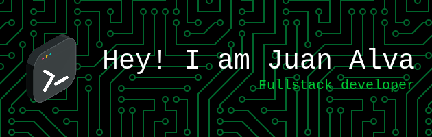

### Hello there 

I am a Full Stack Developer with a solid background in Systems Engineering, passionate about merging the **MERN Stack**, **Cloud Computing**, and **Data Analytics** to create scalable and impactful tech solutions. My approach focuses on aligning technology with business processes and strategy, ensuring sustainable innovation.

**Highlighted Projects:**

- 🚀 AuditFlow (Winner - BCP’s GenIAthon): Developed an audit walkthrougs automation platform using the MERN Stack, Tailwind CSS, and the OpenAI API.
- 🔬 Melanoma Detection App (Huawei Competition Finalist): Created a cloud-based diagnostic tool using Huawei Cloud, Apache, and Astro.
- 🌄 ExploraPeru (Make it Real project): Built a tourism promotion platform with the MERN Stack, GitFlow, Stripe integration, Railway deployment, and Cypress testing.

### Core Skills

**Programming Languages:**  

**Frameworks & Libraries:**  

**Databases & Data Tools:**

**Data Analytics, AI & Automation:**

**Cloud & DevOps:**  
 Identity and Access management (IAM), Kubernetes (IKS), Openshift (ROKS), PowerVS, VMware, Virtual Private Cloud (VPC), Portworx Backup, LogDNA, Watson X, Code Engine.     
 ModelArts, FunctionGraph, RDS for MySQL, API Gateway, Elastic Load Balancer (ELB), Elastic Cloud Server (ECS), Elatic IP (EIP), Object Storage Service (OBS), AutoScaling (AS)   
 API management (APIM), Azure Databricks  
 Amazon EC2, Amazon S3, AWS Lambda

**Methodologies & Tools:**  

**Business & Strategy Tools:**  

**Let’s Connect:**

- **Email:** [jlalvac@uni.pe](mailto:jlalvac@uni.pe)
- **LinkedIn:** [linkedin.com/in/juan-luis-alva](https://www.linkedin.com/in/juan-luis-alva)
- **GitHub:** [github.com/jlac8](https://github.com/jlac8)

Ready to drive innovation, scalability, and growth within your team.
